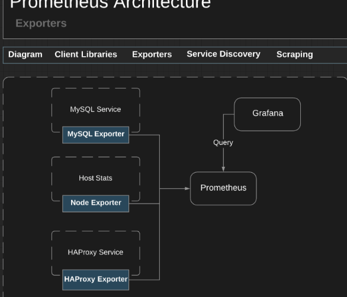
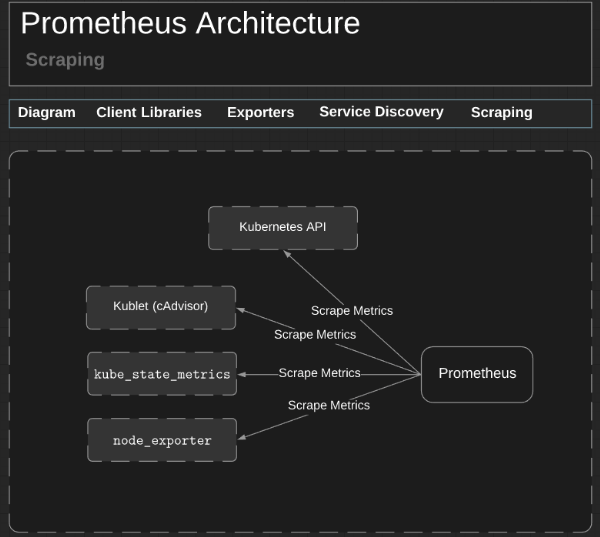

# Monitorando Kubernetes com Prometheus
---
# Topcis

- Prometheus architecture
- Run Prometheus on Kubernetes
- Application Monitoring
- PromQL
- Alerting
---

# What is Prometheus ?

- It's a metrics-based monitoring system
- Developed by `SoundClound` in 2012
- Written in `go`
- Cloud Native Computing Foundation project, make parte in 2016
- Can trigger alerts if some condition is observed to be true

# Features

- Multi-dimensional data model with time series data identified by metric name and key/value pairs
- PromQL, a flexible query language to leverage this dimensionality
- No reliance on distributed storage; single server nodes are autonomous
- Time series collection happens via a pull model over HTTP
- Pushing time series is supported via an intermediary gateway
- Targets are discovered via service discovery or static configuration
- Multiple modes of graphing and dashboarding support

# Components

The Prometheus ecosystem consists of multiple components, many of which are optional:

- The main Prometheus server which scrapes and stores time series data
- Client libraries for instrumenting application code
- A push gateway for supporting short-lived jobs
- Special-purpose exporters for services like HAProxy, StatsD, Graphite, etc.
- An alertmanager to handle alerts
- Various support tools

# Architecture


---
# Setting up a Kubernetes cluster (master)

1 - Disable swap
```
swapoff -a
```
2 - Edit: `/etc/fstab`
```
vi /etc/fstab
```

3 - Comment out swap
```
#/root/swap swap swap sw 0 0
```

4 - Add the Kubernetes repo
```
cat << EOF > /etc/yum.repos.d/kubernetes.repo
[kubernetes]
name=Kubernetes
baseurl=https://packages.cloud.google.com/yum/repos/kubernetes-el7-x86_64
enabled=1
gpgcheck=1
repo_gpgcheck=1
gpgkey=https://packages.cloud.google.com/yum/doc/yum-key.gpg https://packages.cloud.google.com/yum/doc/rpm-package-key.gpg
exclude=kube*
EOF
```

5 - Disable SELinux
```
setenforce 0
```

6 - Permanently disable SELinux:
```
vi /etc/selinux/config
```

7 - Change enforcing to disabled
```
SELINUX=disabled
```
8 - Install Kubernetes 1.11.3
```
yum install -y kubelet-1.11.3 kubeadm-1.11.3 kubectl-1.11.3 kubernetes-cni-0.6.0 --disableexcludes=kubernetes
```

9 - Start and enable the Kubernetes service
```
systemctl start kubelet && systemctl enable kubelet
```

10 - Create the k8s.conf file:

```
cat << EOF >  /etc/sysctl.d/k8s.conf
net.bridge.bridge-nf-call-ip6tables = 1
net.bridge.bridge-nf-call-iptables = 1
EOF
sysctl --system
```

11 - Create kube-config.yml:
```
vi kube-config.yml
```

12 - Add the following to kube-config.yml:
```
apiVersion: kubeadm.k8s.io/v1alpha1
kind:
kubernetesVersion: "v1.11.3"
networking:
  podSubnet: 10.244.0.0/16
apiServerExtraArgs:
  service-node-port-range: 8000-31274
```

13 - Initialize Kubernetes
```
kubeadm init --config kube-config.yml
```

14 - Copy admin.conf to your home directory

```
mkdir -p $HOME/.kube
cp -i /etc/kubernetes/admin.conf $HOME/.kube/config
chown $(id -u):$(id -g) $HOME/.kube/config
```

15 - Install flannel
```
kubectl apply -f https://raw.githubusercontent.com/coreos/flannel/v0.9.1/Documentation/kube-flannel.yml
```

16 - Patch flannel
```
vi /etc/kubernetes/manifests/kube-controller-manager.yaml
```

Add the following to kube-controller-manager.yaml:
```
--allocate-node-cidrs=true
--cluster-cidr=10.244.0.0/16
```

Then reolad kubelete
```
systemctl restart kubelet
```

## Setting up the Kubernetes Worker

Now that the setup for the Kubernetes master is complete, we will begin the process of configuring the worker node. The following actions will be executed on the Kubernetes worker.

1 - Disable swap
```
swapoff -a
```

2 - Edit: /etc/fstab
```
vi /etc/fstab
```

3 - Comment out swap
```
#/root/swap swap swap sw 0 0
```

4 - Add the Kubernetes repo
```
cat << EOF > /etc/yum.repos.d/kubernetes.repo
[kubernetes]
name=Kubernetes
baseurl=https://packages.cloud.google.com/yum/repos/kubernetes-el7-x86_64
enabled=1
gpgcheck=1
repo_gpgcheck=1
gpgkey=https://packages.cloud.google.com/yum/doc/yum-key.gpg https://packages.cloud.google.com/yum/doc/rpm-package-key.gpg
exclude=kube*
EOF
```

5 - Disable SELinux
```
setenforce 0
```

6 - Permanently disable SELinux:
```
vi /etc/selinux/config
```

7 - Change enforcing to disabled
```
SELINUX=disabled
```

8 - Install Kubernetes 1.11.3
```
yum install -y kubelet-1.11.3 kubeadm-1.11.3 kubectl-1.11.3 kubernetes-cni-0.6.0 --disableexcludes=kubernetes
```

9 - Start and enable the Kubernetes service
```
systemctl start kubelet && systemctl enable kubelet
```

10 - Create the k8s.conf file:
```
cat << EOF >  /etc/sysctl.d/k8s.conf
net.bridge.bridge-nf-call-ip6tables = 1
net.bridge.bridge-nf-call-iptables = 1
EOF
sysctl --system
```

11 - Use the join token to add the Worker Node to the cluster:
```
kubeadm join < MASTER_IP >:6443 --token < TOKEN > --discovery-token-ca-cert-hash sha256:< HASH >
```

12 - On the master node, test to see if the cluster was created properly.

13 - Get a listing of the nodes:
```
kubectl get nodes
```

---
# Client Libraries

Prometheus scrapes your application's HTTP endpoint. Client libraries send the current state of all metrics tracked to the Prometheus server.

You can develop your own client library if one doesn't exist.

This is the code used to instrument the app using the NodeJS library prom-client:

```
var Register = require('prom-client').register;
var Counter = require('prom-client').Counter;
var Histogram = require('prom-client').Histogram;
var Summary = require('prom-client').Summary;
var ResponseTime = require('response-time');


module.exports.totalNumOfRequests = totalNumOfRequests = new Counter({
    name: 'totalNumOfRequests',
    help: 'Total number of requests made',
    labelNames: ['method']
});

module.exports.pathsTaken = pathsTaken = new Counter({
    name: 'pathsTaken',
    help: 'Paths taken in the app',
    labelNames: ['path']
});

module.exports.responses = responses = new Summary({
    name: 'responses',
    help: 'Response time in millis',
    labelNames: ['method', 'path', 'status']
});

module.exports.startCollection = function () {
    require('prom-client').collectDefaultMetrics();
};

module.exports.requestCounters = function (req, res, next) {
    if (req.path != '/metrics') {
        totalNumOfRequests.inc({ method: req.method });
        pathsTaken.inc({ path: req.path });
    }
    next();
}

module.exports.responseCounters = ResponseTime(function (req, res, time) {
    if(req.url != '/metrics') {
        responses.labels(req.method, req.url, res.statusCode).observe(time);
    }
})

module.exports.injectMetricsRoute = function (App) {
    App.get('/metrics', (req, res) => {
        res.set('Content-Type', Register.contentType);
        res.end(Register.metrics());
    });
};

```
Prometheus supported libraries:

- Go
- Java or Scala
- Python
- Ruby

Third-party libraries:
- Bash
- C++
- Common Lisp
- Elixir
- Erlang
- Haskell
- Lua for Nginx
- Lua for Tarantool
- .NET / C#
- Node.js
- Perl
- PHP
- Rust


---
# Exporters

Exporters are software that is deployed next to the application that you want to have metrics collected from. Instrumentation for exporters are known as `custom collectors` or `ConstMetrics`.

How exporters work:

- Takes requests
- Gathers the data
- Formats the data
- Returns the data to Prometheus

Databases:

- Consul exporter
- Memcached exporter
- MySQL server exporter

Hardware:

- Node/system metrics exporter

HTTP:

- HAProxy exporter

Other monitoring systems:

- AWS CloudWatch exporter
- Collectd exporter
- Graphite exporter
- InfluxDB exporter
- JMX exporter
- SNMP exporter
- StatsD exporter

Miscellaneous:

- Blackbox exporter



# Service Discovery



# Scraping


---
# Setting up Prometheus

> https://github.com/linuxacademy/content-kubernetes-prometheus-env

In this lesson, we will set up Prometheus on the Kubernetes cluster. We will be creating:

- A metrics namespace for our environment to live in
- A ClusterRole to give Prometheus access to targets using Service Discovery
- A ConfigMap map that will be used to generate the Prometheus config file
- A Prometheus Deployment and Service
- Kube State Metrics to get access to metrics on the Kubernetes API
You can clone the YAML files form Github.

Create a file called `namespaces.yml`. This file will be used to create the monitoring namespace.
`namespaces.yml`

```
{
  "kind": "Namespace",
  "apiVersion": "v1",
  "metadata": {
    "name": "monitoring",
    "labels": {
      "name": "monitoring"
    }
  }
}
```

Apply the namespace:

```
kubectl apply -f namespaces.yml
```

Create a file called `clusterRole.yml`. This will be used to set up the cluster's roles.
`clusterRole.yml`:

```
apiVersion: rbac.authorization.k8s.io/v1beta1
kind: ClusterRole
metadata:
  name: prometheus
rules:
- apiGroups: [""]
  resources:
  - nodes
  - nodes/proxy
  - services
  - endpoints
  - pods
  verbs: ["get", "list", "watch"]
- apiGroups:
  - extensions
  resources:
  - ingresses
  verbs: ["get", "list", "watch"]
- nonResourceURLs: ["/metrics"]
  verbs: ["get"]
---
apiVersion: rbac.authorization.k8s.io/v1beta1
kind: ClusterRoleBinding
metadata:
  name: prometheus
roleRef:
  apiGroup: rbac.authorization.k8s.io
  kind: ClusterRole
  name: prometheus
subjects:
- kind: ServiceAccount
  name: default
  namespace: monitoring
```

Apply the cluster roles to the Kubernetes cluster:

```
kubectl apply -f clusterRole.yml
```

Create `config-map.yml`. Kubernetes will use this file to manage the prometheus.yml configuration file.
`config-map.yml`:

```
apiVersion: v1
kind: ConfigMap
metadata:
  name: prometheus-server-conf
  labels:
    name: prometheus-server-conf
  namespace: monitoring
data:
  prometheus.yml: |-
    global:
      scrape_interval: 5s
      evaluation_interval: 5s

    scrape_configs:
      - job_name: 'kubernetes-apiservers'

        kubernetes_sd_configs:
        - role: endpoints
        scheme: https

        tls_config:
          ca_file: /var/run/secrets/kubernetes.io/serviceaccount/ca.crt
        bearer_token_file: /var/run/secrets/kubernetes.io/serviceaccount/token

        relabel_configs:
        - source_labels: [__meta_kubernetes_namespace, __meta_kubernetes_service_name, __meta_kubernetes_endpoint_port_name]
          action: keep
          regex: default;kubernetes;https

      - job_name: 'kubernetes-nodes'

        scheme: https

        tls_config:
          ca_file: /var/run/secrets/kubernetes.io/serviceaccount/ca.crt
        bearer_token_file: /var/run/secrets/kubernetes.io/serviceaccount/token

        kubernetes_sd_configs:
        - role: node

        relabel_configs:
        - action: labelmap
          regex: __meta_kubernetes_node_label_(.+)
        - target_label: __address__
          replacement: kubernetes.default.svc:443
        - source_labels: [__meta_kubernetes_node_name]
          regex: (.+)
          target_label: __metrics_path__
          replacement: /api/v1/nodes/${1}/proxy/metrics


      - job_name: 'kubernetes-pods'

        kubernetes_sd_configs:
        - role: pod

        relabel_configs:
        - source_labels: [__meta_kubernetes_pod_annotation_prometheus_io_scrape]
          action: keep
          regex: true
        - source_labels: [__meta_kubernetes_pod_annotation_prometheus_io_path]
          action: replace
          target_label: __metrics_path__
          regex: (.+)
        - source_labels: [__address__, __meta_kubernetes_pod_annotation_prometheus_io_port]
          action: replace
          regex: ([^:]+)(?::\d+)?;(\d+)
          replacement: $1:$2
          target_label: __address__
        - action: labelmap
          regex: __meta_kubernetes_pod_label_(.+)
        - source_labels: [__meta_kubernetes_namespace]
          action: replace
          target_label: kubernetes_namespace
        - source_labels: [__meta_kubernetes_pod_name]
          action: replace
          target_label: kubernetes_pod_name

      - job_name: 'kubernetes-cadvisor'

        scheme: https

        tls_config:
          ca_file: /var/run/secrets/kubernetes.io/serviceaccount/ca.crt
        bearer_token_file: /var/run/secrets/kubernetes.io/serviceaccount/token

        kubernetes_sd_configs:
        - role: node

        relabel_configs:
        - action: labelmap
          regex: __meta_kubernetes_node_label_(.+)
        - target_label: __address__
          replacement: kubernetes.default.svc:443
        - source_labels: [__meta_kubernetes_node_name]
          regex: (.+)
          target_label: __metrics_path__
          replacement: /api/v1/nodes/${1}/proxy/metrics/cadvisor

      - job_name: 'kubernetes-service-endpoints'

        kubernetes_sd_configs:
        - role: endpoints

        relabel_configs:
        - source_labels: [__meta_kubernetes_service_annotation_prometheus_io_scrape]
          action: keep
          regex: true
        - source_labels: [__meta_kubernetes_service_annotation_prometheus_io_scheme]
          action: replace
          target_label: __scheme__
          regex: (https?)
        - source_labels: [__meta_kubernetes_service_annotation_prometheus_io_path]
          action: replace
          target_label: __metrics_path__
          regex: (.+)
        - source_labels: [__address__, __meta_kubernetes_service_annotation_prometheus_io_port]
          action: replace
          target_label: __address__
          regex: ([^:]+)(?::\d+)?;(\d+)
          replacement: $1:$2
        - action: labelmap
          regex: __meta_kubernetes_service_label_(.+)
        - source_labels: [__meta_kubernetes_namespace]
          action: replace
          target_label: kubernetes_namespace
        - source_labels: [__meta_kubernetes_service_name]
          action: replace
          target_label: kubernetes_name
```

Create the ConfigMap:

```
kubectl apply -f config-map.yml
```

Create `prometheus-deployment.yml`. This file will be used to create the Prometheus deployment; which will include the pods, replica sets and volumes.
`prometheus-deployment.yml`

```
apiVersion: extensions/v1beta1
kind: Deployment
metadata:
  name: prometheus-deployment
  namespace: monitoring
spec:
  replicas: 1
  template:
    metadata:
      labels:
        app: prometheus-server
    spec:
      containers:
        - name: prometheus
          image: prom/prometheus:v2.2.1
          args:
            - "--config.file=/etc/prometheus/prometheus.yml"
            - "--storage.tsdb.path=/prometheus/"
            - ""--web.enable-lifecycle"
          ports:
            - containerPort: 9090
          volumeMounts:
            - name: prometheus-config-volume
              mountPath: /etc/prometheus/
            - name: prometheus-storage-volume
              mountPath: /prometheus/
      volumes:
        - name: prometheus-config-volume
          configMap:
            defaultMode: 420
            name: prometheus-server-conf

        - name: prometheus-storage-volume
          emptyDir: {}
```

Deploy the Prometheus environment:

```
kubectl apply -f prometheus-deployment.yml
```

Finally, we will finish off the Prometheus environment by creating a server to make publicly accessible. Create prometheus-service.yml.
prometheus-service.yml:

```
apiVersion: v1
kind: Service
metadata:
  name: prometheus-service
  namespace: monitoring
  annotations:
      prometheus.io/scrape: 'true'
      prometheus.io/port:   '9090'

spec:
  selector:
    app: prometheus-server
  type: NodePort
  ports:
    - port: 8080
      targetPort: 9090
      nodePort: 8080
```

Create the service that will make Prometheus publicly accessible:

```
kubectl apply -f prometheus-service.yml
```

Create the `clusterRole.yml` file to set up access so Prometheus can access metrics using Service Discovery.
`clusterRole.yml`


```
apiVersion: rbac.authorization.k8s.io/v1beta1
kind: ClusterRole
metadata:
  name: prometheus
rules:
- apiGroups: [""]
  resources:
  - nodes
  - nodes/proxy
  - services
  - endpoints
  - pods
  verbs: ["get", "list", "watch"]
- apiGroups:
  - extensions
  resources:
  - ingresses
  verbs: ["get", "list", "watch"]
- nonResourceURLs: ["/metrics"]
  verbs: ["get"]
---
apiVersion: rbac.authorization.k8s.io/v1beta1
kind: ClusterRoleBinding
metadata:
  name: prometheus
roleRef:
  apiGroup: rbac.authorization.k8s.io
  kind: ClusterRole
  name: prometheus
subjects:
- kind: ServiceAccount
  name: default
  namespace: monitoring
```

Crate the Kube State Metrics pod to get access to metrics on the Kubernetes API:
kube-state-metrics.yml:

```
apiVersion: v1
kind: Service
metadata:
  name: kube-state-metrics
  namespace: monitoring
  labels:
    app: kube-state-metrics
  annotations:
    prometheus.io/scrape: 'true'
spec:
  ports:
  - name: metrics
    port: 8080
    targetPort: metrics
    protocol: TCP
  selector:
    app: kube-state-metrics
---
apiVersion: extensions/v1beta1
kind: Deployment
metadata:
  name: kube-state-metrics
  namespace: monitoring
  labels:
    app: kube-state-metrics
spec:
  replicas: 1
  template:
    metadata:
      name: kube-state-metrics-main
      labels:
        app: kube-state-metrics
    spec:
      containers:
        - name: kube-state-metrics
          image: quay.io/coreos/kube-state-metrics:latest
          ports:
          - containerPort: 8080
            name: metrics
```

**Access Prometheus by visiting https://<MASTER_IP>:8080**

# Configuring Prometheus


# Grafana

In this lesson, you will learn how to deploy a Grafana pod and service to Kubernetes.

Create grafana-deployment.yml. This file will be used to create the Grafana deployment. Be sure to change the password.

grafana-deployment.yml:

```
apiVersion: extensions/v1beta1
kind: Deployment
metadata:
  name: grafana
  namespace: monitoring
  labels:
    app: grafana
    component: core
spec:
  replicas: 1
  template:
    metadata:
      labels:
        app: grafana
        component: core
    spec:
      containers:
        - image: grafana/grafana:3.1.1
          name: grafana
          env:
            - name: GF_SECURITY_ADMIN_PASSWORD
              value: password
          ports:
            - containerPort: 3000
          volumeMounts:
          - name: grafana-persistent-storage
            mountPath: /var
      volumes:
      - name: grafana-persistent-storage
        emptyDir: {}
```

Deploy Grafana:

```
kubectl apply -f grafana-deployment.yml
```

Crate grafana-service.yml. This file will be used to make the pod publicly accessible.

grafana-service.yml:

```
apiVersion: v1
kind: Service
metadata:
  name: grafana-service
  namespace: monitoring

spec:
  selector:
    app: grafana
  type: NodePort
  ports:
    - port: 3000
      targetPort: 3000
      nodePort: 8000
```

Create the Grafana service:

```
kubectl apply -f grafana-service.yml
```

---
# References

- [Docs. Prometheus](https://prometheus.io/docs/introduction/overview/)
- [Cloud Native](https://www.cncf.io/)
- [Github prometheus linux academy](https://github.com/linuxacademy/content-kubernetes-prometheus-env)
- [kube-state-metrics](https://github.com/kubernetes/kube-state-metrics)
